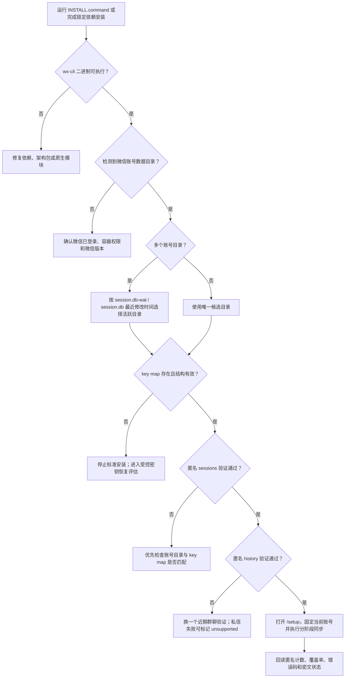

# 微信本机数据读取接入与排障经验

> 更新日期：2026-08-11  
> 适用项目：微信飞书消息分析 Dashboard v1.0.2 及其后续兼容版本  
> 用途：交给另一台 macOS 上的 Codex，作为微信本地只读读取器接入、诊断和受控恢复的参考输入。

## 1. 先读结论

这套 Dashboard 在一台 Apple Silicon Mac、微信 Mac 版 4.1.11、SIP 保持启用的环境中已经跑通真实本地数据读取。真正决定能否成功的环节有四层：

1. 项目运行环境与 `wx-cli` 二进制可用；
2. 正确识别当前正在使用的微信账号数据目录；
3. 当前账号目录对应的数据库 key map 有效；
4. `sessions` 和 `history` 均通过匿名验证，之后才进入 Dashboard 同步。

只跑通 `127.0.0.1` 本机页面，说明 Dashboard 服务可以启动；它不能证明微信数据库已经可解密。只看到 `wx --version`，也只能证明读取器二进制存在。

本机此前最耗时的误判来自“账号目录选错”：系统里同时保留了多个微信账号数据目录，早期脚本使用未排序的 `find ... -print -quit`，总是拿到旧账号目录。候选密钥与旧目录匹配为 0，换成当前活跃目录后立即匹配成功。

另一台 Mac 应优先验证账号目录、key map 和实际解密结果。不要一开始就执行 `wx init`、重签微信、关闭 SIP 或启动 Frida。

## 2. 本文中的事实层级

### 已在原机器验证

- macOS、Apple Silicon；
- 微信 Mac 版 4.1.11；
- `@jackwener/wx-cli` 0.3.0；
- SIP 保持启用；
- 当前活跃账号目录可以通过 `session.db` / `session.db-wal` 最近修改时间识别；
- 21 个数据库 key 映射完成离线匹配；
- `wx sessions` 和 `wx history` 均能读取真实数据；
- Dashboard 可以导入数百个会话元数据，并持续增量读取消息；
- 会话名称、发送者和正文进入 Dashboard SQLite 后均为 AES-256-GCM 密文；
- `~/.wx-cli` 权限为 `0700`，内部敏感文件为 `0600`。

### 只能作为经验参考

- 21 个 key 映射是原机器的结果，不是固定数量；
- 原机器的微信版本、账号数量、数据库分片数量和密钥生命周期可能与接收机器不同；
- 原机器曾做过一次受控的动态研究，不能自动复制到另一台 Mac；
- Intel Mac 的 Node.js 和项目安装链路已覆盖，但微信真实读取没有完成同等级实机验收。

### 必须在接收机器重新确认

- Mac 架构与 macOS 版本；
- 微信版本、Build、当前登录账号；
- 微信数据目录候选数量和当前活跃目录；
- `all_keys.json` 是否存在、是否非空、是否属于该机器当前账号；
- `wx-cli` 二进制版本和 SHA-256；
- daemon 状态；
- `sessions`、`history` 的真实匿名验证结果。

## 3. 排障总流程



这张图的核心原则是逐层验收。任何一层失败，都应保留前面已经通过的状态，针对该层排查，避免重装全部环境或反复操作微信。

## 4. 开始前的安全边界

接收机器上的 Codex 应先遵守以下边界：

1. 不运行 `wx init`。已有 `~/.wx-cli/all_keys.json` 时，它可能覆盖可用映射；微信 4.1.11 的旧静态扫描在原机器上曾返回 0。
2. 不复制原机器或其他人的 `all_keys.json`、微信数据库、Dashboard 数据库或 Keychain 主密钥。
3. 不退出、重启、重签、扫码或重新登录微信，除非当前用户针对该机器给出新的明确授权。
4. 不启动 Frida，不关闭 SIP，不修改微信 entitlement；这些都不属于标准安装流程。
5. 不安装来源不明的 `wx-cli` 镜像或第三方二进制。
6. 不在终端、日志、Issue、聊天或 Markdown 中打印：
   - 账号目录名；
   - 联系人、群名和私信名；
   - 消息正文；
   - 数据库 key、salt 或候选 key；
   - Keychain 内容。
7. 真实验证只输出匿名计数、布尔值、时间戳、覆盖率、二进制摘要和标准化错误码。
8. 不用 `find ... -print -quit` 选择微信账号目录。

## 5. 第一阶段：确认项目和读取器二进制

优先使用完整移交包：

1. 把整个解压文件夹放到固定位置；
2. 右键打开 `INSTALL.command`；
3. 安装完成后进入项目目录；
4. 执行以下检查。

```bash
pnpm reader:inspect
pnpm rebuild better-sqlite3
./node_modules/.bin/eslint .
./node_modules/.bin/tsc --noEmit
pnpm build
```

`pnpm reader:inspect` 只回读读取器版本、实际二进制路径、大小和 SHA-256，不读取联系人或聊天正文。

通过标准：

- 读取器版本能够返回；
- 二进制与当前 Mac 架构匹配；
- `better-sqlite3` 可以重建；
- lint、TypeScript 和 production build 通过。

常见问题：

| 现象 | 原因判断 | 处理方式 |
| --- | --- | --- |
| `wx executable not found` | 依赖未安装完整，或平台可选包缺失 | 重新运行 `INSTALL.command` 或锁定依赖安装，不要单独下载未知二进制 |
| `better-sqlite3` 无法加载 | 原生绑定没有完成 | `pnpm rebuild better-sqlite3`；必要时安装 Xcode Command Line Tools |
| Turbopack 报 `binding to a port: Operation not permitted` | Codex 沙箱禁止临时端口，并非项目代码故障 | 请求本机执行授权后重跑 build |
| `wx` 在 Codex 沙箱中无法写 `~/.wx-cli` | 文件系统沙箱限制 | 请求仅针对读取器命令的本机执行授权；不要因此修改缓存路径或降低权限 |

## 6. 第二阶段：识别当前活跃微信账号目录

微信可能保留多个历史账号目录。账号目录选择是密钥匹配和读取成功的前提。

当前项目的 `lib/wechat-account.ts` 使用以下策略：

1. 枚举微信容器下的账号候选目录；
2. 只保留存在 `db_storage/session/session.db` 或 `session.db-wal` 的候选；
3. 取每个候选中较新的修改时间；
4. 按修改时间倒序，选择最近活动的目录；
5. 首次配置后把账号目录固定在 Dashboard 配置中；
6. 后续检测到活跃账号变化时停止同步，避免不同账号数据混合。

诊断时应在本机进程内比较时间，不把候选目录名或完整路径输出到对话或日志。

推荐判断顺序：

1. 确认微信当前处于正常登录状态；
2. 在微信中进行一次普通浏览操作，等待数据库时间戳更新；
3. 比较各候选目录的 `session.db-wal` 和 `session.db` 修改时间；
4. 优先采用最近更新且时间与当前操作一致的候选；
5. 若两个候选时间非常接近，暂停自动选择，向用户确认当前账号，再逐个做离线解密验证。

原机器的弯路：早期使用未排序的 `find -quit`，拿到了旧账号目录。所有候选 key 对这个旧目录匹配为 0，造成“微信 4.1.11 已完全无法读取”的错误判断。

## 7. 第三阶段：保护并检查 key map

读取器的 key map 位于：

```text
~/.wx-cli/all_keys.json
```

它必须满足：

- 是当前用户拥有的普通文件；
- 不是符号链接；
- 权限为 `0600`；
- JSON 能解析为对象；
- 至少包含一个 `.db` 映射；
- 每个有效映射包含 64 位十六进制 `enc_key`；
- key 与当前机器、当前微信账号目录和当前数据库分片匹配。

检查时只输出：文件是否存在、有效映射数量、无效条目数量、权限是否合格。不要打印键值。

如文件已经存在：

1. 在本机私有目录制作一份受限备份；
2. 备份继续保持 `0600`；
3. 不上传、不传给其他机器；
4. 不执行 `wx init`；
5. 直接进入匿名 `sessions` 验证。

如文件不存在或有效映射数为 0：

- 标准安装已经到达边界；
- 不应从另一台机器复制 key；
- 不应反复运行静态扫描；
- 记录当前微信版本、Build、架构、账号候选数和标准化错误，进入“受控密钥恢复评估”。

项目内的 `scripts/reader/install-key-map.mjs` 只用于安装已经完成离线数据库验证的捕获结果。它会删除候选桶、拒绝空映射，并以 `0600` 原子写入目标文件。不得把未经数据库验证的候选直接安装为正式 key map。

## 8. 第四阶段：权限和 daemon 状态

执行：

```bash
pnpm privacy:harden
node_modules/.bin/wx daemon status
```

期望权限：

```text
~/.wx-cli/             0700
~/.wx-cli/all_keys.json 0600
~/.wechat-dashboard/   0700
Dashboard 数据库、WAL、SHM、配置和状态文件 0600
```

当前 `wx-cli` 0.3.0 的公开命令只提供 `daemon status`、`daemon stop` 和 `daemon logs`，没有可依赖的 `daemon start` 子命令。若状态显示未运行：

1. 先执行下一阶段的匿名 `sessions` 验证；
2. 再次回读 daemon 状态；
3. 若 `sessions` 成功，把 daemon 状态差异记录为运行时表现，不要编造启动命令；
4. 若 `sessions` 失败，保留准确错误码，继续检查 key map、账号目录和读取器运行环境。

不要通过放宽 `~/.wx-cli` 权限解决读取失败。项目会主动拒绝符号链接、异常文件类型、非当前用户所有和 group / other 可读写的路径。

## 9. 第五阶段：匿名验证真实读取

不要直接把 `wx sessions --json` 的原始结果贴进 Codex 对话，它可能包含会话名称和本地标识。使用项目提供的匿名验证脚本。

### 9.1 会话验证

```bash
node scripts/reader/verify-sessions.mjs node_modules/.bin/wx
```

只输出：

- 返回数组长度；
- 群聊数量；
- 私信数量；
- 最新时间戳。

通过标准：命令退出码为 0，返回至少一个可识别会话。脚本的 `total` 上限为 1000，不代表账号全部会话总数。

### 9.2 历史消息验证

```bash
node scripts/reader/verify-history.mjs node_modules/.bin/wx
```

脚本会在最近会话中尝试有限数量的群聊或私信，只输出：

- 会话类型；
- 可读消息数量；
- 最新时间戳。

它不会打印会话名称、用户标识、发送者或正文。

通过标准：至少找到一个近期可读取会话。群聊应作为主要验收对象；某个私信无法解析时，可以继续尝试其他会话，持续失败的私信允许标记为 `unsupported`，不能因此否定整个群聊读取链路。

### 9.3 结果判断

| `sessions` | `history` | 结论 |
| --- | --- | --- |
| 成功 | 成功 | 读取器主链路通过，可以进入 Dashboard `/setup` |
| 失败 | 未执行 | 优先检查 key map 与活跃账号目录是否匹配 |
| 成功 | 所有会话均失败 | 检查消息数据库分片 key；优先换近期群聊验证 |
| 成功 | 仅个别私信失败 | 群聊链路可继续，私信标记为 `unsupported` |
| 沙箱内失败、授权后成功 | 成功 | 属于 Codex 文件系统权限，不是读取器缺陷 |

## 10. 第六阶段：固定账号并进入 Dashboard

只有 `sessions` 和 `history` 都通过后，才打开：

```text
http://127.0.0.1:3000/setup
```

设置页应确认：

- `wxInstalled: true`；
- `wxReaderReady: true`；
- `wxDaemonRunning` 已回读；
- `readerCachePrivate: true`；
- 检测到活跃账号；
- 当前账号与固定账号一致；
- demo mode 关闭。

首次同步采用分阶段策略：

1. 先导入会话元数据；
2. 再读取最近 2 小时活跃会话；
3. 再按小批次补齐当天；
4. 群聊优先；
5. 私信失败可跳过；
6. 之后页面打开期间约 15 分钟做一次页面刷新和增量读取；
7. 每小时按会话时间戳对账。

不要把 7 天或 30 天全量扫描塞进首次同步。原机器曾专门修复“空库直接扫描数百个会话长历史”的性能风险。当前设计使用会话数、消息数、时间、分页和并发上限，并通过稳定消息指纹去重。

## 11. 原机器已经验证的成功结果

以下数据只用于说明链路确实成功，不应作为接收机器的固定预期：

- 21 个数据库 key 映射完成离线匹配；
- 匿名会话验证可以读取数百个可识别会话；
- 群聊和私信元数据均能识别；
- 匿名历史验证可以读取近期群聊消息；
- 首次增量读取成功后，再执行一次增量得到 0 seen / 0 inserted，证明游标和去重有效；
- Dashboard SQLite 中的会话名称、消息正文和发送者均通过密文格式审计；
- 数据库、WAL、SHM 和读取器缓存权限均为当前用户私有。

一旦接收机器达到相同的“会话 + 历史 + Dashboard 匿名回读”三层结果，就应停止继续折腾读取器，不要再尝试捕获密钥或调整微信。

## 12. 遇到过的困难和走过的弯路

### 12.1 把本机页面跑通误认为微信读取已经跑通

`127.0.0.1:3000` 返回页面，只说明 Next.js 服务正常。需要单独验证 `wx-cli`、key map、`sessions` 和 `history`。

### 12.2 选中了旧账号目录

这是原机器最关键的根因。多个账号目录中，文件系统枚举的第一个目录不一定是当前账号。正确方法是比较 `session.db-wal` 和 `session.db` 最近修改时间，并在 Dashboard 首次配置后固定账号。

### 12.3 直接运行 `wx init`

微信 4.1.11 上，旧静态字符串扫描在原机器得到 0 个候选。非高权限执行还出现过 `task_for_pid` 失败。即使经过受控重签并取得 task port，旧字符串扫描仍为 0。继续重复执行没有价值，还可能覆盖现有 `all_keys.json`。

### 12.4 把静态扫描失败误认为所有读取方式失效

原机器后续研究确认数据库 key derivation 链路仍会在实际读取数据库时出现。静态扫描方案失效，只能说明旧扫描特征不再适用，不能直接推导数据库无法解密。

### 12.5 过早评估其他读取器

曾评估一个替代读取器，其文档只明确支持微信 4.1.7 / 4.1.8，并要求关闭 SIP。原机器选择保持 SIP 启用，因此没有采用。另一台机器也不应因为当前工具受阻，就直接安装未验证镜像或关闭系统安全能力。

### 12.6 动态附加没有触发数据库链路

早期动态实验只启动微信，没有打开会话或触发历史读取，因此捕获为 0。后来在明确授权下打开会话并滚动历史，才观察到 PBKDF2 与 AES 调用。这个事实说明动态研究高度依赖触发路径，也说明它不适合成为标准安装步骤。

### 12.7 把 key 候选匹配到错误目录

动态研究曾得到一批候选，匹配旧账号目录全部为 0；匹配当前活跃目录后解析出 21 个数据库。密钥捕获与离线数据库匹配必须使用同一账号、同一机器、同一阶段的数据库。

### 12.8 Frida session 退出影响微信进程

多次实验中，Frida detach 后微信主进程曾退出，需要手动恢复。频繁重试会影响用户使用，并增加账号风险。因此当前项目规则禁止 Codex 自行启动 Frida 或反复重启微信。

### 12.9 沙箱权限误报

Codex 受限环境中，`wx sessions` 曾因不能写入 `~/.wx-cli` 而失败；在获得本机执行权限后，同一命令成功。先区分沙箱权限与读取器实际错误，再决定是否修改代码。

### 12.10 首次同步范围过大

空库直接扫描全部会话长历史会非常慢，也容易把局部私信失败放大为整体失败。最终方案改为元数据、最近 2 小时、当天分批、15 分钟增量，并固定群聊优先。

## 13. 受控密钥恢复的决策门槛

满足以下全部条件，才可以向用户提出一次受控恢复方案：

1. `wx-cli` 二进制与依赖已通过；
2. 当前活跃账号目录已经可靠识别；
3. `all_keys.json` 缺失、为空，或离线验证明确不匹配；
4. 沙箱权限、文件权限和账号切换已排除；
5. 已记录微信版本、Build、Mac 架构和匿名错误码；
6. 标准读取链路没有其他安全替代；
7. 用户针对该机器明确批准相应高风险操作。

当前项目默认不授权以下动作：

- 重签微信；
- 修改 entitlement；
- 启动 Frida；
- 关闭 SIP；
- 高频退出、重启或扫码；
- 从其他机器复制 key map。

接收机器上的 Codex 应在达到门槛后停下，提交一份受控恢复计划，列明目标、必要性、预计影响、回滚方式和需要的用户批准。不能把原机器曾经获得的授权沿用到新机器。

如果用户后续确实批准研究路径，仍应坚持：

1. 先在本机私有目录备份现有 key map；
2. 只做一次受控尝试，不循环重试；
3. 保持 SIP 启用，除非用户另行作出高风险决定；
4. 动态捕获结果只写入 `0700` 临时目录、`0600` 文件；
5. 候选必须与已确认的活跃数据库目录做离线匹配；
6. 只安装通过数据库验证的映射；
7. 验证成功后立即停止研究工具，并确认微信恢复正常；
8. 任何 key、账号目录或聊天正文都不得进入 Git、对话或移交包。

本文不提供重签、关闭 SIP 或动态注入的执行脚本。它们属于单独的高风险恢复工作，不属于 Dashboard 的标准安装和验收。

## 14. 错误现象与优先排查表

| 现象 | 最可能原因 | 优先动作 |
| --- | --- | --- |
| `wxReaderReady: false` | key map 缺失、权限不合格、解密失败 | 检查 key map 结构、权限和账号目录匹配；不要运行 `wx init` |
| `WX_COMMAND_FAILED` | 解密、运行环境或沙箱权限 | 用匿名脚本在获批本机环境重试；保留 stderr 的标准化分类 |
| `WECHAT_ACCOUNT_CHANGED` | 当前活跃账号与固定账号不同 | 停止同步，确认微信当前账号，重新进入 `/setup` |
| `sessions` 返回 0 | 旧账号目录、空 key map 或 key 不匹配 | 先核对账号目录时间戳，再做离线 key 验证 |
| `sessions` 成功、`history` 失败 | 消息分片 key 缺失、目标会话不可解析 | 换近期群聊验证，检查 message 数据库映射 |
| 仅私信无法读取 | 私信标识或解析差异 | 标记为 `unsupported`，继续群聊主链路 |
| daemon 显示未运行 | 读取器运行时状态或报告差异 | 先运行匿名 `sessions`，再回读状态；不要编造 start 命令 |
| Dashboard 显示 demo 数据 | `/setup` 尚未完成真实账号固定 | 完成读取器验收后重新配置，确认 demo mode 关闭 |
| 首次同步长时间不结束 | 扫描范围过大或局部会话反复失败 | 保持分阶段上限，群聊优先，私信失败不作为完成条件 |
| 页面可开但无真实消息 | 只验证了 Web 服务 | 回到 `sessions` / `history` 两层匿名验证 |

## 15. 推荐向原用户回报的匿名诊断结果

接收机器完成诊断后，只回报以下结构：

```json
{
  "mac_arch": "arm64_or_x86_64",
  "macos_version": "major.minor",
  "wechat_version": "version_and_build",
  "wx_cli_version": "version",
  "wx_binary_sha256": "sha256",
  "account_candidate_count": 0,
  "active_account_detected": false,
  "key_map_exists": false,
  "valid_key_mapping_count": 0,
  "reader_cache_private": false,
  "daemon_running": false,
  "sessions_check": "pass_or_error_code",
  "history_check": "pass_or_error_code",
  "dashboard_configured": false,
  "next_safe_action": "one concise action"
}
```

不要增加账号目录、联系人、群名、私信名、消息正文或任何 key 值。

## 16. 给接收机器 Codex 的建议输入

```text
请先完整阅读这份《微信本机数据读取接入与排障经验》。

目标是在当前 Mac 上只读接入当前用户自己的微信本地数据。请严格按“运行环境 → 活跃账号目录 → key map → sessions → history → Dashboard”的顺序诊断。

开始时只执行匿名、低风险检查。不要运行 wx init，不要复制其他机器的 all_keys.json、数据库或 Keychain 内容，不要退出、重启、重签或重新登录微信，不要启动 Frida，不要关闭 SIP，不要安装来源不明的读取器。不要在输出中显示账号目录名、联系人、群名、私信名、消息正文或 key。

请先运行项目的 reader:inspect、privacy:harden、verify-sessions.mjs 和 verify-history.mjs，并在本机内部按 session.db-wal / session.db 最近修改时间识别当前活跃账号。只向我返回匿名计数、布尔值、二进制 SHA-256 和标准化错误码。

如果标准链路失败，请先区分沙箱权限、多个账号目录、key map 缺失和 key 不匹配。达到文档中的“受控密钥恢复门槛”后停止，不要自行执行高风险恢复；提交一份包含必要性、影响、回滚和所需授权的方案，等待我确认。
```

## 17. 最终成功标准

接收机器达到以下全部条件后，才算真实读取接入完成：

- `pnpm reader:inspect` 通过；
- 当前活跃账号目录已经可靠识别并固定；
- key map 非空、结构有效、权限为 `0600`；
- `~/.wx-cli` 和 `~/.wechat-dashboard` 权限合格且无符号链接；
- 匿名 `sessions` 验证通过；
- 匿名 `history` 验证通过；
- `/setup` 显示真实读取器就绪、demo mode 关闭；
- 首次元数据同步完成；
- 至少一个群聊完成有限历史或增量读取；
- 连续两次增量验证没有重复写入；
- Dashboard SQLite 中敏感字段保持密文；
- 日志、Git 和移交包中没有真实聊天数据、账号目录或密钥；
- 没有遗留 Frida、常驻 Dashboard 服务、cron、LaunchAgent 或后台 AI 调度。

达到成功标准后，停止修改微信和读取器，转入正常的按需 Dashboard 使用与 15 分钟页面刷新、增量同步。

## 18. 整理依据

这份指南综合了以下当前实现与历史验证记录：

- `README.md`、`PRIVACY.md`、`SECURITY.md`、`TRANSFER.md`；
- `lib/wechat-account.ts`、`lib/wx.ts`、`lib/sync-service.ts`；
- `scripts/reader/inspect-reader.mjs`；
- `scripts/reader/verify-sessions.mjs`；
- `scripts/reader/verify-history.mjs`；
- `scripts/reader/harden-permissions.mjs`；
- `scripts/reader/install-key-map.mjs`；
- 原机器的本地 Context / Handoff 与匿名验收记录。

历史记录中的旧模型、旧 UI 和旧发布状态不适用于当前版本；本文只提取微信本机读取器的接入、验证、安全与排障经验。
